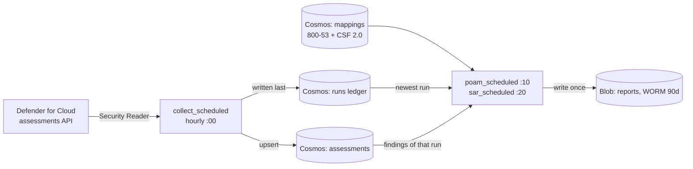

# Architecture

How the pipeline is put together and why each boundary is where it is. Controls are in
[CONTROLS.md](CONTROLS.md); the reasoning behind the choices is in [DECISIONS.md](DECISIONS.md);
how to check any claim yourself is in [PROOFS.md](PROOFS.md).

## Data flow

Nothing to the right of Cosmos ever calls Defender. The report generators read three containers and write
one blob container; that is the whole of their reach.

## Stages, each its own root module and state file

| Stage | Owns | Consumes |
|---|---|---|
| 01-foundation | management groups, policies and initiative, remediation identity, Log Analytics, activity-log tripwire | nothing |
| 02-activation | Defender plans, enabled only where discovery found them missing | 01 |
| 03-evidence-store | Cosmos account and containers, WORM storage, collector Function App | 01 |
| 04-reporting | reporting Function App and its role assignments | 01, 03 |
| 06-enforcement | the `modify` policy and its remediation mode | 01 |

Stages read each other only through outputs (`terraform_remote_state`). No stage changes another stage's
resources, so a bad apply is bounded by the stage it ran in.

## Identities

| Identity | Can | Cannot |
|---|---|---|
| Collector (system-assigned) | read Defender assessments and resource group tags (Security Reader), write Cosmos | write blobs, generate reports |
| Reporter (system-assigned) | read Cosmos, write the reports container | read Defender, write evidence |
| Remediation (user-assigned) | Monitoring Contributor and Storage Account Contributor at `mg-grc-sandbox` | anything at subscription scope, Owner or Contributor |
| CI (OIDC federated) | plan and validate, read state | store a secret: there is none |

No secrets exist anywhere in the repo or in CI variables. Inside Azure every call uses a managed identity;
GitHub Actions authenticates with OIDC against a federated credential.

## Evidence data model

| Container | Partition | One document per | Purpose |
|---|---|---|---|
| `assessments` | `/subscriptionId` | assessment, resource and run | the findings; never overwritten by a later sweep |
| `runs` | `/subscriptionId` | collection sweep | the ledger: when, timer or manual, counts, severity breakdown |
| `frameworks` | `/frameworkId` | framework or category | CSF 2.0 and 800-53 Rev.5 catalogue records |
| `mappings` | `/frameworkId` | assessment and framework | crosswalk: which controls an assessment evidences |

An assessment document's id is `sha256(assessmentId|resourceId|runId)[:32]`.

## Schedule

The collector runs at :00, the POA&M at :10 and the SAR at :20 of every hour. A production build would spread
this over a day (POA&M) and a week (SAR); this build runs the same code on a compressed cadence so a run
history accumulates over hours. Each report is named after the sweep it was cut from.
